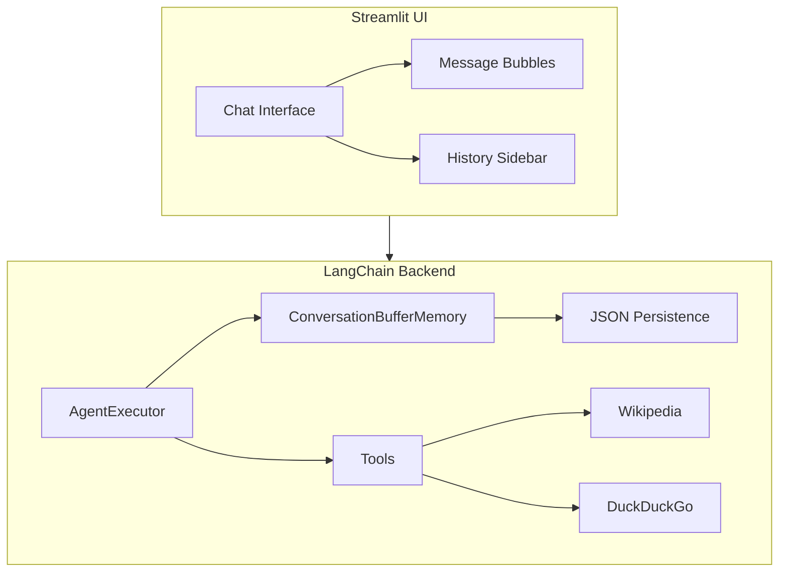

# 🤖 Nova - Conversational Knowledge Bot

A premium ChatGPT/Gemini-style knowledge bot built with LangChain, featuring conversation memory, Wikipedia/web search tools, and a stunning Streamlit UI.


## ✨ Features

| Feature | Description |
|---------|-------------|
| 🧠 **Conversation Memory** | Remembers context for follow-up questions |
| 📚 **Wikipedia Search** | Access encyclopedic knowledge |
| 🌐 **Web Search** | Real-time information via DuckDuckGo |
| 💬 **Natural Chat** | Friendly, conversational responses |
| 📜 **Chat History** | Persistent storage with sidebar navigation |
| 🎨 **Premium UI** | Dark theme with smooth animations |

## 🏗️ Architecture



## 🚀 Quick Start

### 1. Install Dependencies

```bash
pip install -r requirements.txt
```

### 2. Configure API Key

Create a `.env` file in the project root:

```env
GOOGLE_API_KEY=your_gemini_api_key_here
```

Get your free API key from [Google AI Studio](https://aistudio.google.com/)

### 3. Run the Bot

```bash
streamlit run app.py
```

The app will open at `http://localhost:8501`

## 📁 Project Structure

```
TASK/
├── app.py              # Streamlit UI
├── agent.py            # LangChain agent with tools
├── memory.py           # Conversation memory & persistence
├── tools.py            # Wikipedia & web search tools
├── config.py           # Configuration settings
├── styles.css          # Premium CSS styling
├── requirements.txt    # Python dependencies
├── .env.example        # Environment template
├── README.md           # Documentation
└── chat_history/       # Saved conversations (auto-created)
```

## 🧠 Memory Design

Nova uses a **two-tier memory system**:

1. **Session Memory** (`ConversationBufferMemory`)
   - In-memory storage for active conversation
   - Enables contextual follow-up questions
   - Example: "Who is Sam Altman?" → "Where did he study?"

2. **Persistent Storage** (JSON files)
   - Saves conversations to `chat_history/` directory
   - Survives app restarts
   - Enables history sidebar navigation

## 🛠️ Tools

### Wikipedia Search
- Queries Wikipedia for factual information
- Returns summaries with source links
- Best for: People, places, events, concepts

### DuckDuckGo Search
- Real-time web search
- No API key required
- Best for: Current events, recent news

## 💬 Sample Chat Logs

```
👤 User: Who is the CEO of OpenAI?

🤖 Nova: The CEO of OpenAI is Sam Altman! 🌟

Sam Altman is an American entrepreneur and investor who has been 
leading OpenAI since 2019. He was previously the president of 
Y Combinator, the famous startup accelerator.

📚 Source: https://en.wikipedia.org/wiki/Sam_Altman
🔍 Searched for information

---

👤 User: Where did he study?

🤖 Nova: Sam Altman studied at Stanford University! 🎓

He enrolled at Stanford in 2004 to study computer science, but 
dropped out after two years to focus on his startup Loopt, which 
was a location-based social networking app.

📚 Source: https://en.wikipedia.org/wiki/Sam_Altman
🔍 Searched for information

---

👤 User: Explain how photosynthesis works

🤖 Nova: Photosynthesis is the amazing process plants use to 
convert sunlight into food! 🌱☀️

Here's how it works:

1. **Light Absorption**: Chlorophyll in leaves captures sunlight
2. **Water Splitting**: Light energy splits water molecules (H₂O)
3. **CO₂ Capture**: Plants absorb carbon dioxide from air
4. **Sugar Production**: Energy combines CO₂ + H₂O → glucose
5. **Oxygen Release**: Oxygen is released as a byproduct

The formula: 6CO₂ + 6H₂O + Light → C₆H₁₂O₆ + 6O₂
```

## 🎨 UI Features

- **Dark Theme**: Premium dark color scheme
- **Glassmorphism**: Modern glass-like effects
- **Animations**: Smooth slide-in messages, typing indicators
- **Responsive**: Works on desktop and mobile
- **History Sidebar**: Quick access to past conversations

## ⚙️ Configuration

Edit `config.py` to customize:

```python
MODEL_NAME = "gemini-1.5-flash"  # Model to use
TEMPERATURE = 0.7                 # Response creativity
BOT_NAME = "Nova"                 # Bot's name
MAX_HISTORY_LENGTH = 50           # Messages to keep
```

## 📝 License

MIT License - Feel free to use and modify!

---

<div align="center">
  <p>Built with ❤️ using LangChain & Streamlit</p>
  <p>🤖 <strong>Nova</strong> - Your Knowledge Companion</p>
</div>
